# Mermaid 图表指南

本文档提供 Mermaid 图表的使用指南，帮助生成清晰、准确的技术文档图表。

## 常用图表类型

### 1. 架构图（graph TB/LR）

用于展示系统模块关系、数据流向。

**语法**：
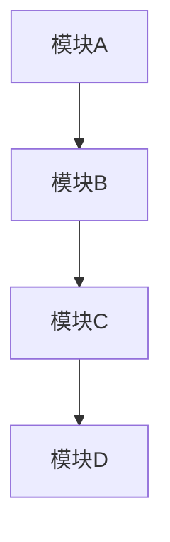

**适用场景**：
- 系统架构图
- 模块依赖关系
- 数据流向图

**示例**：
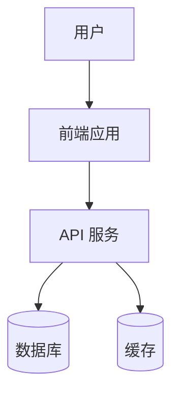

### 2. 流程图（flowchart TD）

用于展示业务流程、算法逻辑。

**语法**：
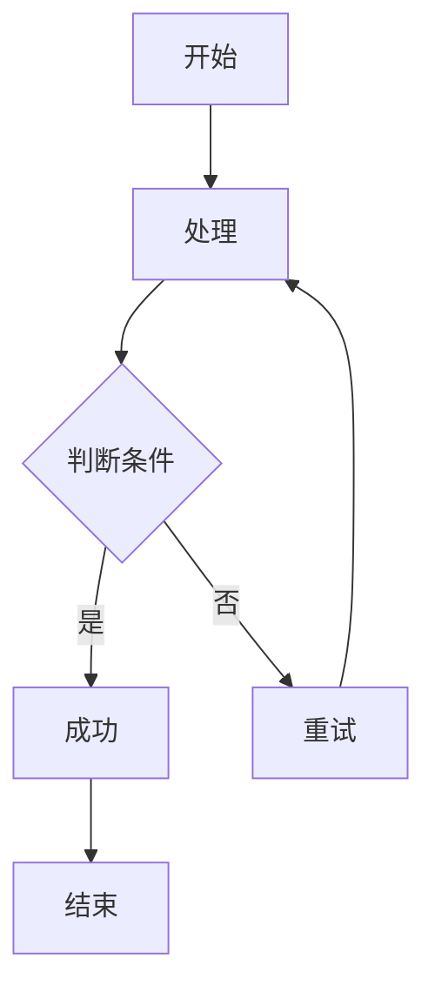

**适用场景**：
- 业务流程
- 算法逻辑
- 决策树

### 3. 时序图（sequenceDiagram）

用于展示组件间的交互时序。

**语法**：
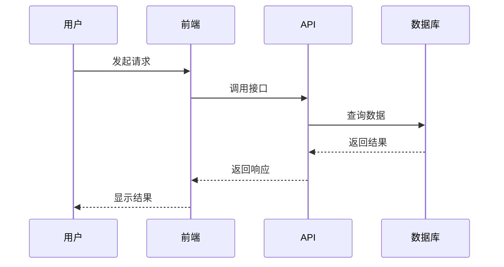

**适用场景**：
- API 调用流程
- 组件交互
- 消息传递

### 4. 状态图（stateDiagram-v2）

用于展示状态机、生命周期。

**语法**：
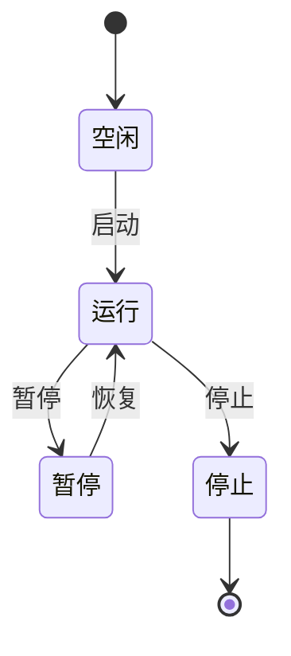

**适用场景**：
- 状态机
- 生命周期
- 工作流状态

### 5. 类图（classDiagram）

用于展示类结构、继承关系。

**语法**：
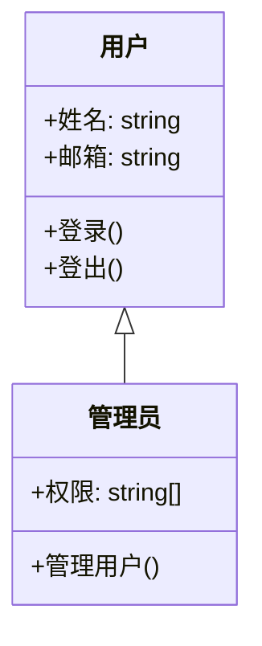

**适用场景**：
- 类结构
- 继承关系
- 接口定义

## 中文标签规范

### 节点命名

✅ **推荐**：使用有意义的中文名称
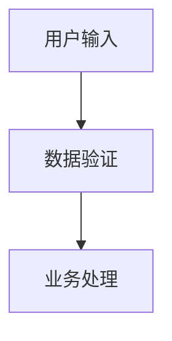

❌ **不推荐**：使用抽象的字母
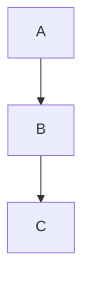

### 边标签

使用中文描述关系：
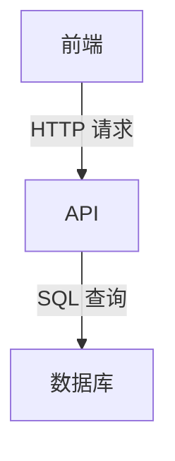

### 分组（subgraph）

使用中文分组名称：
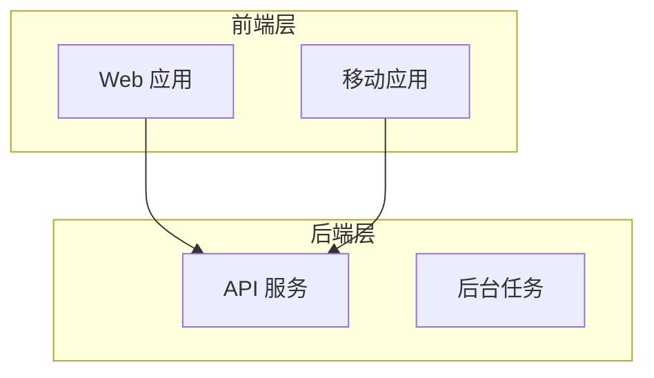

## 图表优化技巧

### 1. 控制节点数量

- 单个图表节点数量控制在 **20 个以内**
- 超过 20 个节点时，考虑拆分为多个图表

### 2. 合理使用方向

- `TB`（Top to Bottom）：适合层级结构
- `LR`（Left to Right）：适合流程图
- `TD`（Top Down）：同 TB

### 3. 使用样式


### 4. 避免交叉线

调整节点顺序，减少连线交叉：

❌ **不好**：


✅ **更好**：


## 常见错误

### 1. 缺少闭合的反引号

❌ **错误**：
```markdown
\`\`\`mermaid
graph TB
    A --> B
（缺少闭合的 \`\`\`）
```

✅ **正确**：
```markdown
\`\`\`mermaid
graph TB
    A --> B
\`\`\`
```

### 2. 特殊字符未转义

❌ **错误**：
```mermaid
graph TB
    A[用户(管理员)] --> B
```

✅ **正确**：
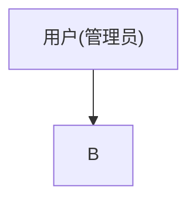

### 3. 箭头语法错误

❌ **错误**：
```mermaid
graph TB
    A -> B  （单箭头）
```

✅ **正确**：
```mermaid
graph TB
    A --> B  （双箭头）
```

## 实际示例

### 系统架构图

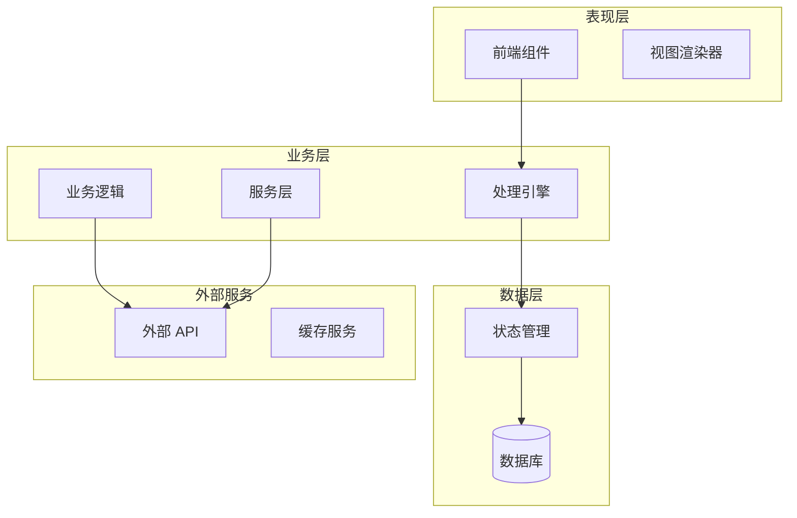

### 数据流时序图

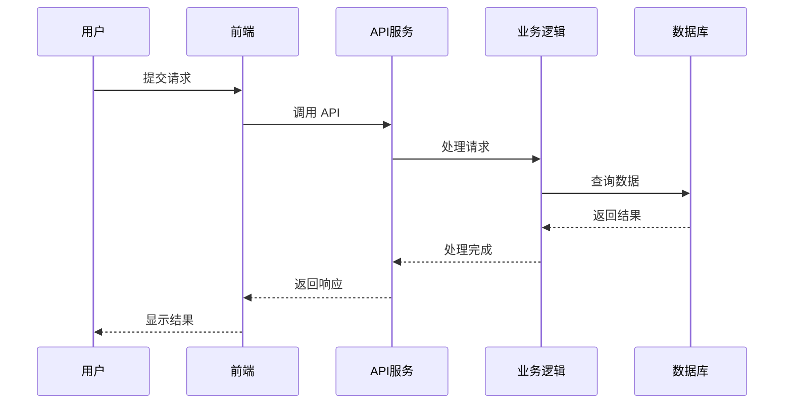

### 状态机图

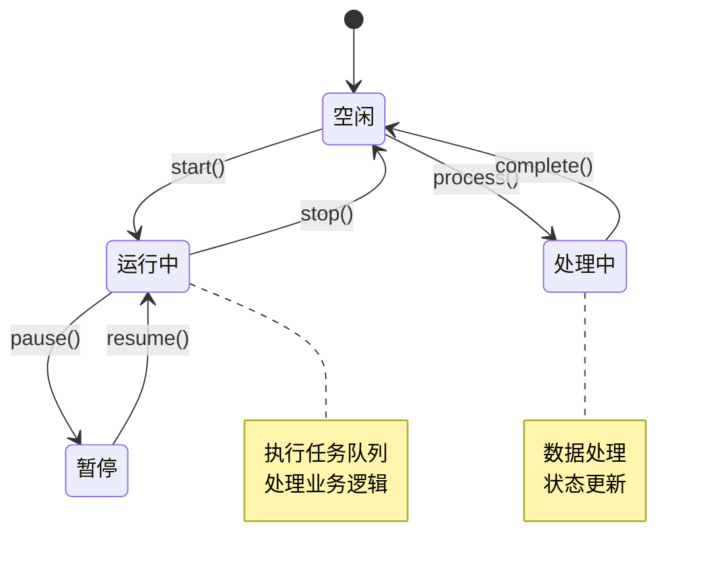

## 验证图表

生成图表后，使用以下方法验证：

### 1. 语法检查

```bash
# 检查 mermaid 代码块是否闭合
grep -A 20 '```mermaid' docs/*.md | grep -c '```'
```

### 2. 在线预览

使用 [Mermaid Live Editor](https://mermaid.live/) 预览图表。

### 3. 常见问题检查清单

- [ ] 所有代码块都有闭合的 ```
- [ ] 节点名称使用中文
- [ ] 特殊字符已转义（使用引号）
- [ ] 箭头语法正确（-->）
- [ ] 节点数量 ≤ 20
- [ ] 图表方向合理（TB/LR）
